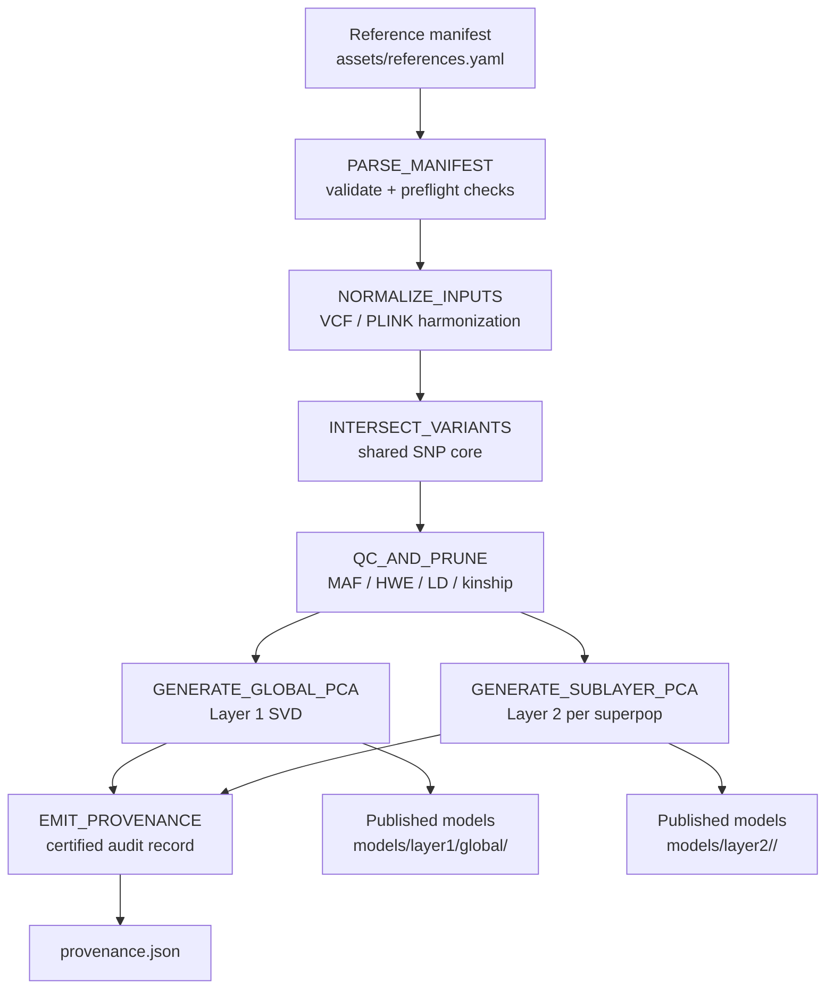

# nf_PopPCA_refgen

[](https://www.nextflow.io/)
[](https://github.com/features/packages)
[](LICENSE)
[](https://www.python.org/)
[](https://www.cog-genomics.org/plink/2.0/)

A regulatory-compliant, deterministic Nextflow DSL2 pipeline for constructing two-layer population reference PCA models (Global + Superpopulations) for genomic variant classification and sample projection.

## Key architectural features

### Two-layer SVD decomposition

The pipeline constructs a two-stage reference space:

- **Layer 1 — Global reference space**: a merged, QCed PCA basis spanning **3,494 samples** across 1000 Genomes + HGDP.
- **Layer 2 — Continental superpopulation models**: independent PCA models for **AFR, AMR, EAS, EUR, and SAS**.

This design lets downstream samples be projected into a stable global coordinate system first, then evaluated against a relevant continental model.

### Regulatory compliance & auditability

- Runtime **SHA-256 pre-flight verification** of manifest-declared inputs.
- Post-execution **`provenance.json` certification** containing:
  - hardware and kernel details
  - PLINK / Python tool versions
  - execution command line
  - exact parameter lineage
  - config and model checksums

### Multi-mount portability

The pipeline supports a configurable `--ref_dir` parameter so reference data can be mounted from an external storage array without rewriting manifest paths.

## Architecture & dataflow

### Execution flow



## Flexible Reference Ingestion & Diverse Cohort Vision

The ingestion architecture is designed to let users add, remove, or substitute reference cohorts by editing only `assets/references.yaml`, without changing pipeline code. This supports mixed-assay builds that combine WGS and SNP microarray cohorts under a single harmonized ancestry model workflow.

### Architectural Design For Mixed Assays

- `NORMALIZE_INPUTS` ingests configured `vcf`, `plink1`, and `plink2` datasets and harmonizes them into canonical GRCh38-compatible variant IDs (`CHROM:POS:REF:ALT`).
- `INTERSECT_VARIANTS` computes the consensus shared locus core dynamically across all active cohorts defined in the manifest.
- `QC_AND_PRUNE` applies missingness and LD pruning controls so high-density WGS cohorts do not dominate or bias the shared coordinate basis relative to sparser array panels.

### Vision For Diverse Reference Expansion

The pipeline is architecturally ready for broad cohort expansion, including large global references and regional panels (for example 1000G, HGDP, All of Us, biobank cohorts, and specialized regional or indigenous population references) as data become available.

As new cohorts are released, users can extend the ancestry coordinate basis by adding new manifest entries in `assets/references.yaml`, then rerunning the same workflow.

### Example Mixed-Cohort Manifest Snippet

```yaml
datasets:
  - id: cohort_wgs_global
    active: true
    assay: WGS
    superpop: GLOBAL
    build: GRCh38
    input:
      format: vcf
      paths:
        - path: inputs/cohort_wgs/global_chr1.vcf.gz
          expected_sha256: "<sha256>"

  - id: cohort_array_regional
    active: true
    assay: Microarray
    superpop: AMR
    build: GRCh38
    input:
      format: plink1
      paths:
        - path: inputs/array/regional_panel.bed
        - path: inputs/array/regional_panel.bim
        - path: inputs/array/regional_panel.fam
```

### Two-layer projection framework

For a standardized patient dosage matrix $\tilde{X}$ and a normalized weight matrix $W$, the projected principal component score is computed as:

$$PC_{patient, k} = \sum_{j} \tilde{X}_{ij} \cdot W_{jk}$$

where \(\tilde{X}_{ij}\) is the standardized genotype dosage for variant \(j\) and \(W_{jk}\) is the normalized variant load weight for component \(k\).

```text
Downstream patient VCF
        |
        v
  Normalize / harmonize
        |
        v
  Project into Layer 1 global PCA space
        |
        +--> global ancestry sanity check / coarse classification
        |
        v
  Route to the relevant Layer 2 superpopulation model
        |
        v
  Fine-grained sample projection / classification
```

## Pipeline Dependencies & Methods

- PLINK 1.9 (`v1.90b6.21` or equivalent 1.9 build) is used for initial multi-cohort reference merging and dataset harmonization.
- PLINK 2 (`v2.00a3+`) is used for high-throughput variant filtering, LD pruning, and PCA eigenvector/allele loading computations.

These tools are orchestrated through the Nextflow DSL2 modules in `modules/local/` and are version-captured in provenance outputs.

## Quickstart & usage

### Integration test

```bash
nextflow run . -profile test --ref_manifest .ci/references.yaml --infrastructure_config .ci/infrastructure.yaml --outdir .ci/results --stub-run
```

### Production execution

```bash
nextflow run . -profile docker --ref_dir "/path/to/reference_mount" --outdir "./results"
```

### Execution parameters

| Parameter | Purpose | Example |
|---|---|---|
| `--ref_dir` | Base directory used to resolve relative input paths from `assets/references.yaml` | `/mnt/ref_bundle` |
| `--outdir` | Published output directory | `./results` |
| `--ref_manifest` | Active reference manifest | `assets/references.yaml` |
| `--maf` | Minor allele frequency filter | `0.01` |
| `--hwe` | Hardy-Weinberg equilibrium filter | `1e-6` |
| `--ld_window` | LD pruning window | `50` |
| `--ld_r2` | LD pruning $r^2$ threshold | `0.2` |
| `--pca_components` | Number of PCs to compute | `10` |

## Configuration Workflows

Use one of the following configuration workflows depending on whether you want per-run flexibility or persistent defaults.

### 1. Dynamic CLI Overrides (At Runtime)

All key parameters, paths, and manifests can be overridden directly in the launch command for each run.

Example runtime override command:

```bash
nextflow run . \
  -profile docker \
  --ref_dir /mnt/ref_bundle \
  --ref_manifest assets/references.yaml \
  --outdir ./results_run01
```

Example for projection/integration wrappers that also expose model path arguments such as `--global_pcs`:

```bash
nextflow run . --ref_dir /mnt/ref_bundle --global_pcs /mnt/models/layer1/global/global_pca.eigenvec --outdir ./results_projection
```

### 2. Direct Asset File Modification (Zero-CLI Default Configuration)

To set persistent local defaults, edit the asset files directly:

- `assets/params.yaml`
- `assets/references.yaml`
- `assets/infrastructure.yaml`

After updating these files, run with a clean default command and no extra CLI flags:

```bash
nextflow run .
```

## Configuration Assets Overview

- `assets/params.yaml`: user-facing pipeline defaults including QC thresholds, PCA dimensions, and default run paths.
- `assets/references.yaml`: active cohort manifest, dataset paths, coordinate-build declarations, and optional SHA-256 integrity expectations.
- `assets/infrastructure.yaml`: executor/container runtime defaults plus CPU and memory allocation limits.

Each configuration file includes inline documentation headers so defaults can be edited directly in place without requiring command-line parameter overrides.

## Pre-computed Example Reference Model

The repository includes a ready-to-use baseline bundle under `example/models/` so developers can inspect coordinates, validate integration logic, and test cohort mapping without rebuilding the full reference set first.

These example artifacts are committed directly to Git for immediate exploration, while large normalized weight matrices can be pulled in on demand.

For full instructions, architecture notes, and an end-to-end two-layer routing example (`PROCESS_LAYER1_PROJECTION` -> `ASSIGN_SUPERPOP` -> `PROCESS_LAYER2_PROJECTION`), see `example/README.md`.

## Pre-computed reference model bundle

For patient projection workflows, users do not need to rebuild the full reference model bundle on every run. The heavy reference matrices can be distributed as pre-computed release artifacts and reused for downstream projection.

Recommended usage pattern:

1. Download the published model bundle from GitHub Releases.
2. Point the projection workflow at the unpacked `models/` directory.
3. Reuse the pre-computed `.normalized_weights.tsv` files when projecting new patient VCFs.

Use the release helper to fetch the published weight matrices directly:

```bash
# Download pre-computed reference model weights
./bin/download_models.sh --outdir ./models
```

Set `MODEL_BUNDLE_URL` to a GitHub Releases or Zenodo archive URL before running the helper. The script downloads the bundle, computes SHA-256 checksums for each `.normalized_weights.tsv` file, and verifies them against the published hashes before the bundle is considered usable.

## Output directory specification

Published outputs are written under `${params.outdir}/models/`, and audit files are written at the root of `${params.outdir}` plus `${params.tracedir}`.

| Output path | Typical file size | Description | Biological / mathematical purpose |
|---|---:|---|---|
| `models/layer1/global/` | ~459 MB | Layer 1 global PCA assets (`eigenvec`, `eigenval`, `allele`, `normalized_weights`, `afreq`, sample manifest, summary) | Defines the global ancestry basis used for coarse projection and cohort sanity checks |
| `models/layer2/` | ~2.2 GB | Layer 2 superpopulation PCA assets for AFR / AMR / EAS / EUR / SAS | Provides finer ancestry models for classification and within-continent projection |
| `provenance.json` | small | Certified audit record | Captures exact inputs, checksums, tool versions, hardware, and command-line lineage |
| `pipeline_info/` | small to moderate | Timeline, report, trace, and DAG artifacts | Operational traceability, timing, and troubleshooting |

Current reference output footprint observed in this repository:

- `results/`: ~2.6 GB
- `results/models/layer1/global/`: ~459 MB
- `results/models/layer2/`: ~2.2 GB

## CI and smoke testing

The repository’s GitHub Actions workflow performs a deterministic smoke test on every push and pull request by:

1. creating synthetic VCF and PLINK2 inputs under `.ci/inputs/`
2. generating a synthetic manifest and infrastructure file
3. running `nextflow run . -profile test -stub-run --without-docker`
4. verifying that `.ci/results/models/reference_manifest.json` is created

This validates DSL2 wiring, manifest parsing, fan-out, and final manifest generation without needing production reference data.

## Audit & provenance verification

The generated `provenance.json` can be used to verify both technical and regulatory traceability.

Check the following blocks:

- `environment`
  - kernel / OS string
  - CPU model
  - memory totals
  - PLINK, awk, and Python versions
  - execution command line
- `config_lineage`
  - SHA-256 for `assets/params.yaml`
  - SHA-256 for the resolved high-LD BED file
- `matrix_qc_summary`
  - global sample and variant counts
  - per-superpopulation sample and variant counts
- `input_lineage`
  - every staged input file and its SHA-256 checksum
- `output_manifests`
  - root output references and the global normalized-weights checksum

Typical verification steps:

1. Open `provenance.json`.
2. Confirm the `execution_command` matches the run you expect.
3. Confirm `params.ref_dir` points to the intended reference mount.
4. Confirm input file checksums match the published reference bundle.
5. Confirm CPU and RAM values match the intended execution platform.

## Requirements

- Nextflow `25.04.3+`
- Java 17+
- Python 3.10+
- PLINK 2.0-compatible container environment
- Docker or Apptainer, or SLURM with a supported container runtime
- GRCh38 reference inputs

## Repository layout

- `assets/references.yaml` — active reference manifest
- `assets/params.yaml` — user-facing defaults
- `assets/infrastructure.yaml` — runtime infrastructure profile
- `modules/local/` — DSL2 process modules
- `main.nf` — workflow orchestration
- `nextflow.config` — runtime defaults and profiles
- `results/` — published output tree from a run

## Citation & license

Pipeline version v1.0.0 released with pre-computed reference assets.

This project is intended to be released under the **MIT License**. Include the standard MIT text in the repository or release bundle when publishing artifacts.

For citation guidance, include `CITATION.cff` in the repository or release bundle when publishing artifacts.

Suggested citation summary:

- `nf_PopPCA_refgen`: two-layer population reference PCA pipeline for deterministic genomic projection and classification.

## Notes for operators

- Prefer explicit `--ref_dir` and `--outdir` in production runs.
- Keep the release bundle immutable once published; regenerate reference artifacts only from a controlled, audited pipeline run.
- The default profile is optimized for reproducible local Docker execution.